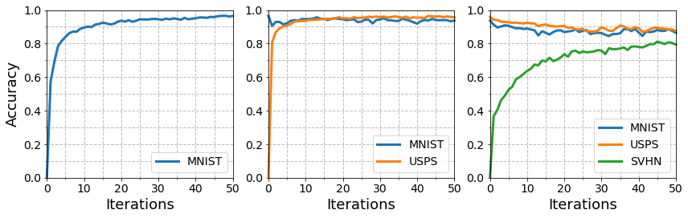

# Deep Generative Replay

A Tensorflow implementation of the **Deep Generative Replay**, introduced in paper titled [**"Continual Learning with Deep Generative Replay"**](https://arxiv.org/pdf/1705.08690.pdf). 

---
## What is Deep Generative Replay?

It is well known that natural cognitive systems recover their memory via the intensive effort to **recall the previous knowledge**. Even we do not try to do so, experience replays unconsciously occur in the human brain during sleep and waking rest. The memory replay must be generative in nature, so some deep learning studies now deal with the way **how the machine accurately generates samples of previously learned tasks for experience replay**. The key point is allowing frequent intervention as part of learning to reinforce the memory retention of the neural network model.

<p align="center"></p></br>

To make such a framework possible, some AI engineers usually deployed the generative adversarial networks. The model architect in the [referred paper](https://arxiv.org/pdf/1705.08690.pdf) considers **sequential training** on their problem-solving agents named **Scholar**, as it is capable of **learning a new task and teaching its knowledge to the next networks**. A scholar is composed of two subagents, the **generator**, and **solver**. 

<p align="center"></p></br>

The role of the generator is to recover the feature space of a domain '𝐷<sub>𝑡</sub>', by learning to mimic the real distribution associated with original samples '𝑥' as closely as possible. Another agent, the solver, then train a couple of real input-target pairs (𝑥, 𝑦) and replayed input-target pairs (𝑥′ , 𝑦′). 

When we want to handle the problem set '𝑇<sub>𝑡</sub>', generator '𝐺<sub>𝑡−1</sub>' produces fake data 𝑥′ and 𝑥′ is fed to '𝐺<sub>𝑡</sub>' with the current data 𝑥. These produced pairs are interleaved with new data to update the generator and solver networks. After '𝐺<sub>𝑡</sub>' finished its training, then the previous solver '𝑆<sub>𝑡−1</sub>' return to the data tuple {𝑥′, 𝑦′}. So what is left to do is train the new solver so it learns from both input-label pairs (𝑥, 𝑦) and (𝑥′, 𝑦′). Through the recursion of these processes, the architecture emulates the complementary learning systems like neocortex in the human brain and maintains a consolidated long-term memory via generative replay of past experiences.

---
## Preparation

### Installing prerequisites

To install the prerequisite, simply type in the shell prompt the following:

```
$ pip install -r requirements.txt
```

You can use TensorFlow libraries with GPU support (See the guide at [TensorFlow tutorials](https://www.tensorflow.org/guide/gpu?hl=en)) to accelerate your code with CUDA back-end.

### Dataset

We prepared 3 different collection of handwritten digits:

<p align="center"></p></br>

* [MNIST](http://yann.lecun.com/exdb/mnist/) : A well-known monochrome handwritten digit image set widely used for training various image processing systems.
* [USPS](https://www.csie.ntu.edu.tw/~cjlin/libsvmtools/datasets/multiclass.html#usps) : Another digit dataset commonly used in domain adaptation, which contains handwritten text scanned from envelopes by the U.S. Postal Service.
* [SVHN](http://ufldl.stanford.edu/housenumbers/) : A real-world dataset containing images of house numbers taken from Google's street view.

Our goal is to train the above three dataset in a particular order. At first, you are going to build two different types of model: a typical classifier (`NaiveNN`) and a deep-generated-replay model (`Scholar`). The `MNIST` will be utilized to build the initial digit classifiers. After that, you will train both models with `USPS` dataset and then the last one, `SVHN`. 

### Note

Since the size of the **SVHN** dataset is too large to upload here, you have to wait a couple of minutes to download `train_32x32.mat` and `test_32x32.mat`. 

---
## Result

Below images are the fake samples constructed by the generator module when it was trained on either `MNIST` or `USPS`.

<p align="center"></p></br>

Run `test.ipynb` and check the experimental results illustrated in the below figures.
You can see the performance of `Naive NN` dramatically degraded whenever it took a subsequent dataset.

<p align="center"></p></br>

On the contrary, the deep-generative replay model does not suffer from catastrophic forgetting as much as `Naive NN`; maintaining relatively good performance during the domain change.

<p align="center"></p></br>
